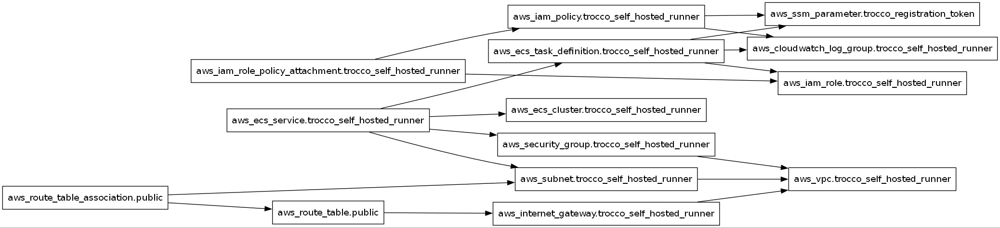
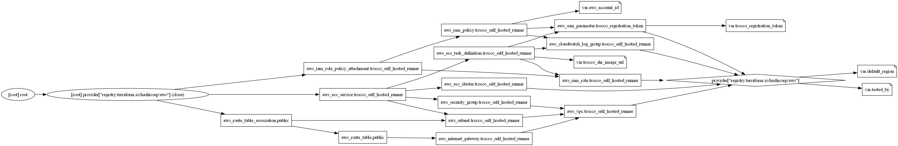

<!-- BEGIN_TF_DOCS -->

# Requirements

| Name | Version |
| ---- | ------- |
| aws  | 6.13.0  |

# Providers

| Name | Version | Alias |
| ---- | ------- | ----- |
| aws  | 6.13.0  | n/a   |

# Inputs

| Name                      | description                                    | Type     | Required | Default | File                |
| ------------------------- | ---------------------------------------------- | -------- | -------- | ------- | ------------------- |
| aws_account_id            | AWSのアカウントID                              | `string` | yes      | n/a     | [main.tf](/main.tf) |
| default_region            | デフォルトのリージョン                         | `string` | yes      | n/a     | [main.tf](/main.tf) |
| tested_by                 | 検証担当者                                     | `string` | yes      | n/a     | [main.tf](/main.tf) |
| trocco_registration_token | TROCCO Self-Hosted-RunnerのRegistration Token  | `string` | yes      | n/a     | [main.tf](/main.tf) |
| trocco_shr_image_url      | TROCCO Self-Hosted-RunnerのコンテナイメージURL | `string` | yes      | n/a     | [main.tf](/main.tf) |

# Resources

| Type     | Name                                                                                                                                                               | File                | Comment                                       |
| -------- | ------------------------------------------------------------------------------------------------------------------------------------------------------------------ | ------------------- | --------------------------------------------- |
| resource | [aws_cloudwatch_log_group.trocco_self_hosted_runner](https://registry.terraform.io/providers/hashicorp/aws/6.13.0/docs/resources/cloudwatch_log_group)             | [main.tf](/main.tf) | CloudWatch Logsのロググループ                 |
| resource | [aws_ecs_cluster.trocco_self_hosted_runner](https://registry.terraform.io/providers/hashicorp/aws/6.13.0/docs/resources/ecs_cluster)                               | [main.tf](/main.tf) | ECSクラスタ、タスク定義、サービス             |
| resource | [aws_ecs_service.trocco_self_hosted_runner](https://registry.terraform.io/providers/hashicorp/aws/6.13.0/docs/resources/ecs_service)                               | [main.tf](/main.tf) | ECSサービス                                   |
| resource | [aws_ecs_task_definition.trocco_self_hosted_runner](https://registry.terraform.io/providers/hashicorp/aws/6.13.0/docs/resources/ecs_task_definition)               | [main.tf](/main.tf) | ECSタスク定義                                 |
| resource | [aws_iam_policy.trocco_self_hosted_runner](https://registry.terraform.io/providers/hashicorp/aws/6.13.0/docs/resources/iam_policy)                                 | [main.tf](/main.tf) | ECS(Fargate)用のIAMポリシー                   |
| resource | [aws_iam_role.trocco_self_hosted_runner](https://registry.terraform.io/providers/hashicorp/aws/6.13.0/docs/resources/iam_role)                                     | [main.tf](/main.tf) | ECS(Fargate)用のIAMロール                     |
| resource | [aws_iam_role_policy_attachment.trocco_self_hosted_runner](https://registry.terraform.io/providers/hashicorp/aws/6.13.0/docs/resources/iam_role_policy_attachment) | [main.tf](/main.tf) | IAMロールとポリシーの関連付け                 |
| resource | [aws_internet_gateway.trocco_self_hosted_runner](https://registry.terraform.io/providers/hashicorp/aws/6.13.0/docs/resources/internet_gateway)                     | [main.tf](/main.tf) | インターネットゲートウェイ                    |
| resource | [aws_route_table.public](https://registry.terraform.io/providers/hashicorp/aws/6.13.0/docs/resources/route_table)                                                  | [main.tf](/main.tf) | インターネットゲートウェイへのルート          |
| resource | [aws_route_table_association.public](https://registry.terraform.io/providers/hashicorp/aws/6.13.0/docs/resources/route_table_association)                          | [main.tf](/main.tf) | サブネットとルートテーブルの関連付け          |
| resource | [aws_security_group.trocco_self_hosted_runner](https://registry.terraform.io/providers/hashicorp/aws/6.13.0/docs/resources/security_group)                         | [main.tf](/main.tf) | セキュリティグループ                          |
| resource | [aws_ssm_parameter.trocco_registration_token](https://registry.terraform.io/providers/hashicorp/aws/6.13.0/docs/resources/ssm_parameter)                           | [main.tf](/main.tf) | SSM Parameter StoreにRegistration Tokenを保存 |
| resource | [aws_subnet.trocco_self_hosted_runner](https://registry.terraform.io/providers/hashicorp/aws/6.13.0/docs/resources/subnet)                                         | [main.tf](/main.tf) | サブネット                                    |
| resource | [aws_vpc.trocco_self_hosted_runner](https://registry.terraform.io/providers/hashicorp/aws/6.13.0/docs/resources/vpc)                                               | [main.tf](/main.tf) | VPC                                           |

# Dependency Graph

## Overview

## Detail

<!-- END_TF_DOCS -->

# Setup

- Install AWS CLI
- Login AWS by `aws configure`
