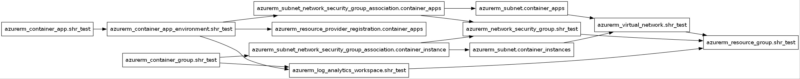
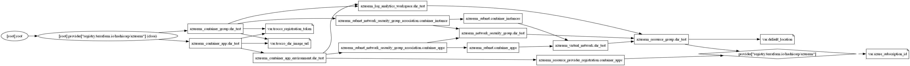

<!-- BEGIN_TF_DOCS -->

# Requirements

| Name    | Version |
| ------- | ------- |
| azurerm | 4.47.0  |

# Providers

| Name    | Version | Alias |
| ------- | ------- | ----- |
| azurerm | 4.47.0  | n/a   |

# Inputs

| Name                                          | description                                                          | Type     | Required | Default | File                |
| --------------------------------------------- | -------------------------------------------------------------------- | -------- | -------- | ------- | ------------------- |
| azure_subscription_id                         | AzureのSubscription ID                                               | `string` | yes      | n/a     | [main.tf](/main.tf) |
| default_location                              | デフォルトのロケーション                                             | `string` | yes      | n/a     | [main.tf](/main.tf) |
| trocco_registration_token_container_apps      | Container Apps用のTROCCO Self-Hosted-RunnerのRegistration Token      | `string` | yes      | n/a     | [main.tf](/main.tf) |
| trocco_registration_token_container_instances | Container Instances用のTROCCO Self-Hosted-RunnerのRegistration Token | `string` | yes      | n/a     | [main.tf](/main.tf) |
| trocco_shr_image_url                          | TROCCO Self-Hosted-RunnerのコンテナイメージURL                       | `string` | yes      | n/a     | [main.tf](/main.tf) |

# Resources

| Type     | Name                                                                                                                                                                                              | File                | Comment                                                                                                                                                         |
| -------- | ------------------------------------------------------------------------------------------------------------------------------------------------------------------------------------------------- | ------------------- | --------------------------------------------------------------------------------------------------------------------------------------------------------------- |
| resource | [azurerm_container_app.shr_test](https://registry.terraform.io/providers/hashicorp/azurerm/4.47.0/docs/resources/container_app)                                                                   | [main.tf](/main.tf) | Container Apps                                                                                                                                                  |
| resource | [azurerm_container_app_environment.shr_test](https://registry.terraform.io/providers/hashicorp/azurerm/4.47.0/docs/resources/container_app_environment)                                           | [main.tf](/main.tf) | Container Apps Environment                                                                                                                                      |
| resource | [azurerm_container_group.shr_test](https://registry.terraform.io/providers/hashicorp/azurerm/4.47.0/docs/resources/container_group)                                                               | [main.tf](/main.tf) | Container Instances ip_address_type = "None"でports未指定でもデプロイ可能だが、サブネットを指定できないのでアウトバウンドネットワークの制御ができないと思われる |
| resource | [azurerm_log_analytics_workspace.shr_test](https://registry.terraform.io/providers/hashicorp/azurerm/4.47.0/docs/resources/log_analytics_workspace)                                               | [main.tf](/main.tf) | Log Analytics ワークスペース                                                                                                                                    |
| resource | [azurerm_network_security_group.shr_test](https://registry.terraform.io/providers/hashicorp/azurerm/4.47.0/docs/resources/network_security_group)                                                 | [main.tf](/main.tf) | ネットワークセキュリティグループ                                                                                                                                |
| resource | [azurerm_resource_group.shr_test](https://registry.terraform.io/providers/hashicorp/azurerm/4.47.0/docs/resources/resource_group)                                                                 | [main.tf](/main.tf) | リソースグループ                                                                                                                                                |
| resource | [azurerm_resource_provider_registration.container_apps](https://registry.terraform.io/providers/hashicorp/azurerm/4.47.0/docs/resources/resource_provider_registration)                           | [main.tf](/main.tf) | Container Apps 用のリソースプロバイダー登録                                                                                                                     |
| resource | [azurerm_subnet.container_apps](https://registry.terraform.io/providers/hashicorp/azurerm/4.47.0/docs/resources/subnet)                                                                           | [main.tf](/main.tf) | Container Apps用サブネット                                                                                                                                      |
| resource | [azurerm_subnet.container_instances](https://registry.terraform.io/providers/hashicorp/azurerm/4.47.0/docs/resources/subnet)                                                                      | [main.tf](/main.tf) | Container Instances用サブネット                                                                                                                                 |
| resource | [azurerm_subnet_network_security_group_association.container_apps](https://registry.terraform.io/providers/hashicorp/azurerm/4.47.0/docs/resources/subnet_network_security_group_association)     | [main.tf](/main.tf) | Container Apps用サブネットとネットワークセキュリティグループの関連付け                                                                                          |
| resource | [azurerm_subnet_network_security_group_association.container_instance](https://registry.terraform.io/providers/hashicorp/azurerm/4.47.0/docs/resources/subnet_network_security_group_association) | [main.tf](/main.tf) | Container Instances用サブネットネットワークセキュリティグループの関連付け                                                                                       |
| resource | [azurerm_virtual_network.shr_test](https://registry.terraform.io/providers/hashicorp/azurerm/4.47.0/docs/resources/virtual_network)                                                               | [main.tf](/main.tf) | 仮想ネットワーク                                                                                                                                                |

# Dependency Graph

## Overview

## Detail

<!-- END_TF_DOCS -->

# Setup

- Install Azure CLI
- Login Azure by `az login`
