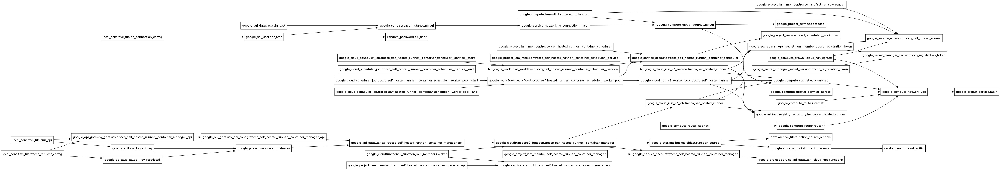

<!-- BEGIN_TF_DOCS -->

# Requirements

| Name        | Version |
| ----------- | ------- |
| google      | 7.3.0   |
| google-beta | 7.5.0   |
| local       | 2.5.3   |
| random      | 3.7.2   |

# Providers

| Name        | Version | Alias |
| ----------- | ------- | ----- |
| archive     | 2.7.1   | n/a   |
| google      | 7.3.0   | n/a   |
| google-beta | 7.5.0   | n/a   |
| local       | 2.5.3   | n/a   |
| random      | 3.7.2   | n/a   |

# Inputs

| Name                      | description                                     | Type     | Required | Default | File                |
| ------------------------- | ----------------------------------------------- | -------- | -------- | ------- | ------------------- |
| default_location          | デフォルトのロケーション                        | `string` | yes      | n/a     | [main.tf](/main.tf) |
| project_id                | Google CloudのProject ID                        | `string` | yes      | n/a     | [main.tf](/main.tf) |
| tested_by                 | 検証担当者                                      | `string` | yes      | n/a     | [main.tf](/main.tf) |
| trocco_registration_token | TROCCO Self-Hosted-RunnerのRegistration Token   | `string` | yes      | n/a     | [main.tf](/main.tf) |
| trocco_shr_image_path     | TROCCO Self-Hosted-RunnerのコンテナイメージPath | `string` | yes      | n/a     | [main.tf](/main.tf) |

# Resources

| Type        | Name                                                                                                                                                                                                             | File                                                                          | Comment                                                                                                                                                  |
| ----------- | ---------------------------------------------------------------------------------------------------------------------------------------------------------------------------------------------------------------- | ----------------------------------------------------------------------------- | -------------------------------------------------------------------------------------------------------------------------------------------------------- |
| resource    | [google-beta_google_api_gateway_api.trocco_self_hosted_runner\_\_container_manager_api](https://registry.terraform.io/providers/hashicorp/google-beta/7.5.0/docs/resources/google_api_gateway_api)               | [api_gateway\_\_cloud_run_functions.tf](/api_gateway__cloud_run_functions.tf) | API GatewayのAPI                                                                                                                                         |
| resource    | [google-beta_google_api_gateway_api_config.trocco_self_hosted_runner\_\_container_manager_api](https://registry.terraform.io/providers/hashicorp/google-beta/7.5.0/docs/resources/google_api_gateway_api_config) | [api_gateway\_\_cloud_run_functions.tf](/api_gateway__cloud_run_functions.tf) | API GatewayのAPI Config ref: https://cloud.google.com/api-gateway/docs/passing-data?hl=ja                                                                |
| resource    | [google-beta_google_api_gateway_gateway.trocco_self_hosted_runner\_\_container_manager_api](https://registry.terraform.io/providers/hashicorp/google-beta/7.5.0/docs/resources/google_api_gateway_gateway)       | [api_gateway\_\_cloud_run_functions.tf](/api_gateway__cloud_run_functions.tf) | API GatewayのGateway                                                                                                                                     |
| resource    | [google_apikeys_key.api_key](https://registry.terraform.io/providers/hashicorp/google/7.3.0/docs/resources/apikeys_key)                                                                                          | [api_gateway\_\_cloud_run_functions.tf](/api_gateway__cloud_run_functions.tf) | 手元で検証するためにIP制限をかけていないAPIキー                                                                                                          |
| resource    | [google_apikeys_key.api_key_restricted](https://registry.terraform.io/providers/hashicorp/google/7.3.0/docs/resources/apikeys_key)                                                                               | [api_gateway\_\_cloud_run_functions.tf](/api_gateway__cloud_run_functions.tf) | 実運用に使うことを想定した、IPベースでTROCCOからのアクセスのみに限定したAPIキー                                                                          |
| resource    | [google_artifact_registry_repository.trocco_self_hosted_runner](https://registry.terraform.io/providers/hashicorp/google/7.3.0/docs/resources/artifact_registry_repository)                                      | [main.tf](/main.tf)                                                           | TROCCOのSelf-Hosted Runner用のDockerイメージを格納するリポジトリ                                                                                         |
| resource    | [google_cloud_run_v2_job.trocco_self_hosted_runner](https://registry.terraform.io/providers/hashicorp/google/7.3.0/docs/resources/cloud_run_v2_job)                                                              | [main.tf](/main.tf)                                                           | TROCCOのSelf-Hosted RunnerをCloud Run Jobsにデプロイ                                                                                                     |
| resource    | [google_cloud_run_v2_service.trocco_self_hosted_runner](https://registry.terraform.io/providers/hashicorp/google/7.3.0/docs/resources/cloud_run_v2_service)                                                      | [main.tf](/main.tf)                                                           | TROCCOのSelf-Hosted RunnerをCloud Run Serviceにデプロイ                                                                                                  |
| resource    | [google_cloud_run_v2_worker_pool.trocco_self_hosted_runner](https://registry.terraform.io/providers/hashicorp/google/7.3.0/docs/resources/cloud_run_v2_worker_pool)                                              | [main.tf](/main.tf)                                                           | TROCCOのSelf-Hosted RunnerをCloud Run Worker Poolsにデプロイ                                                                                             |
| resource    | [google_cloud_scheduler_job.trocco_self_hosted_runner**container_scheduler**service\_\_end](https://registry.terraform.io/providers/hashicorp/google/7.3.0/docs/resources/cloud_scheduler_job)                   | [cloud_scheduler\_\_workflows.tf](/cloud_scheduler__workflows.tf)             | Cloud Run　Serviceを停止するためのCloud Scheduler 外部からのリクエストは全く発生しないので、インスタンス数は0になると思われる                            |
| resource    | [google_cloud_scheduler_job.trocco_self_hosted_runner**container_scheduler**service\_\_start](https://registry.terraform.io/providers/hashicorp/google/7.3.0/docs/resources/cloud_scheduler_job)                 | [cloud_scheduler\_\_workflows.tf](/cloud_scheduler__workflows.tf)             | Cloud Run　Serviceを稼働させるためのCloud Scheduler                                                                                                      |
| resource    | [google_cloud_scheduler_job.trocco_self_hosted_runner**container_scheduler**worker_pool\_\_end](https://registry.terraform.io/providers/hashicorp/google/7.3.0/docs/resources/cloud_scheduler_job)               | [cloud_scheduler\_\_workflows.tf](/cloud_scheduler__workflows.tf)             | Cloud Run　Worker Poolsを停止するためのCloud Scheduler                                                                                                   |
| resource    | [google_cloud_scheduler_job.trocco_self_hosted_runner**container_scheduler**worker_pool\_\_start](https://registry.terraform.io/providers/hashicorp/google/7.3.0/docs/resources/cloud_scheduler_job)             | [cloud_scheduler\_\_workflows.tf](/cloud_scheduler__workflows.tf)             | Cloud Run　Worker Poolsを起動するためのCloud Scheduler                                                                                                   |
| resource    | [google_cloudfunctions2_function.trocco_self_hosted_runner\_\_container_manager](https://registry.terraform.io/providers/hashicorp/google/7.3.0/docs/resources/cloudfunctions2_function)                         | [api_gateway\_\_cloud_run_functions.tf](/api_gateway__cloud_run_functions.tf) | Cloud Run Worker Poolのインスタンス数を調整するCloud Function                                                                                            |
| resource    | [google_cloudfunctions2_function_iam_member.invoker](https://registry.terraform.io/providers/hashicorp/google/7.3.0/docs/resources/cloudfunctions2_function_iam_member)                                          | [api_gateway\_\_cloud_run_functions.tf](/api_gateway__cloud_run_functions.tf) | Cloud Functionを呼び出すための権限を付与                                                                                                                 |
| resource    | [google_compute_firewall.cloud_run_egress](https://registry.terraform.io/providers/hashicorp/google/7.3.0/docs/resources/compute_firewall)                                                                       | [main.tf](/main.tf)                                                           | Cloud Runからインターネットにアクセスするためのファイアウォール                                                                                          |
| resource    | [google_compute_firewall.cloud_run_to_cloud_sql](https://registry.terraform.io/providers/hashicorp/google/7.3.0/docs/resources/compute_firewall)                                                                 | [database.tf](/database.tf)                                                   | Cloud RunからCloud SQLにアクセスするためのファイアウォール                                                                                               |
| resource    | [google_compute_firewall.deny_all_egress](https://registry.terraform.io/providers/hashicorp/google/7.3.0/docs/resources/compute_firewall)                                                                        | [main.tf](/main.tf)                                                           | デフォルトですべてのアウトバウンドトラフィックを拒否するファイアウォール                                                                                 |
| resource    | [google_compute_global_address.mysql](https://registry.terraform.io/providers/hashicorp/google/7.3.0/docs/resources/compute_global_address)                                                                      | [database.tf](/database.tf)                                                   | MySQLにアクセスするためのIPアドレス ref: https://cloud.google.com/sql/docs/mysql/configure-private-services-access?hl=ja                                 |
| resource    | [google_compute_network.vpc](https://registry.terraform.io/providers/hashicorp/google/7.3.0/docs/resources/compute_network)                                                                                      | [main.tf](/main.tf)                                                           | VPC                                                                                                                                                      |
| resource    | [google_compute_route.internet](https://registry.terraform.io/providers/hashicorp/google/7.3.0/docs/resources/compute_route)                                                                                     | [main.tf](/main.tf)                                                           | Internet Gatewayのためののルート                                                                                                                         |
| resource    | [google_compute_router.router](https://registry.terraform.io/providers/hashicorp/google/7.3.0/docs/resources/compute_router)                                                                                     | [main.tf](/main.tf)                                                           | インターネットへのアクセスをNAT経由にルーティング                                                                                                        |
| resource    | [google_compute_router_nat.nat](https://registry.terraform.io/providers/hashicorp/google/7.3.0/docs/resources/compute_router_nat)                                                                                | [main.tf](/main.tf)                                                           | インターネットへのアクセスのためのNAT                                                                                                                    |
| resource    | [google_compute_subnetwork.subnet](https://registry.terraform.io/providers/hashicorp/google/7.3.0/docs/resources/compute_subnetwork)                                                                             | [main.tf](/main.tf)                                                           | サブネット ref: https://cloud.google.com/vpc/docs/configure-private-service-connect-apis?hl=ja                                                           |
| resource    | [google_project_iam_member.self_hosted_runner\_\_container_manager](https://registry.terraform.io/providers/hashicorp/google/7.3.0/docs/resources/project_iam_member)                                            | [api_gateway\_\_cloud_run_functions.tf](/api_gateway__cloud_run_functions.tf) | Cloud Run FunctionsからCloud Run Jobsを起動するための権限を付与                                                                                          |
| resource    | [google_project_iam_member.trocco\_\_artifact_registry_reader](https://registry.terraform.io/providers/hashicorp/google/7.3.0/docs/resources/project_iam_member)                                                 | [main.tf](/main.tf)                                                           | Cloud RunがArtifact Registryのイメージをpullできるようにする権限を付与                                                                                   |
| resource    | [google_project_iam_member.trocco_self_hosted_runner\_\_container_manager_api](https://registry.terraform.io/providers/hashicorp/google/7.3.0/docs/resources/project_iam_member)                                 | [api_gateway\_\_cloud_run_functions.tf](/api_gateway__cloud_run_functions.tf) | API GatewayがCloud Run Functionsを呼び出すための権限を付与                                                                                               |
| resource    | [google_project_iam_member.trocco_self_hosted_runner\_\_container_scheduler](https://registry.terraform.io/providers/hashicorp/google/7.3.0/docs/resources/project_iam_member)                                   | [cloud_scheduler\_\_workflows.tf](/cloud_scheduler__workflows.tf)             | WorkflowsからCloud Run Worker Pools／Servicesを調整するための権限を付与                                                                                  |
| resource    | [google_project_iam_member.trocco_self_hosted_runner**container_scheduler**service](https://registry.terraform.io/providers/hashicorp/google/7.3.0/docs/resources/project_iam_member)                            | [cloud_scheduler\_\_workflows.tf](/cloud_scheduler__workflows.tf)             | WorkflowsからCloud Run Servicesを調整するための権限を付与                                                                                                |
| resource    | [google_project_service.api_gateway](https://registry.terraform.io/providers/hashicorp/google/7.3.0/docs/resources/project_service)                                                                              | [api_gateway\_\_cloud_run_functions.tf](/api_gateway__cloud_run_functions.tf) | API Gatewayのサービスを有効化 有効化には多少の時間がかかるので、applyは失敗することがある                                                                |
| resource    | [google_project_service.api_gateway\_\_cloud_run_functions](https://registry.terraform.io/providers/hashicorp/google/7.3.0/docs/resources/project_service)                                                       | [api_gateway\_\_cloud_run_functions.tf](/api_gateway__cloud_run_functions.tf) | 必要なAPIを有効化                                                                                                                                        |
| resource    | [google_project_service.cloud_scheduler\_\_workflows](https://registry.terraform.io/providers/hashicorp/google/7.3.0/docs/resources/project_service)                                                             | [cloud_scheduler\_\_workflows.tf](/cloud_scheduler__workflows.tf)             | 必要なAPIを有効化                                                                                                                                        |
| resource    | [google_project_service.database](https://registry.terraform.io/providers/hashicorp/google/7.3.0/docs/resources/project_service)                                                                                 | [database.tf](/database.tf)                                                   | 必要なAPIを有効化                                                                                                                                        |
| resource    | [google_project_service.main](https://registry.terraform.io/providers/hashicorp/google/7.3.0/docs/resources/project_service)                                                                                     | [main.tf](/main.tf)                                                           | 必要なAPIを有効化 Service Usage APIを事前に有効化しておく必要がある; https://console.developers.google.com/apis/api/serviceusage.googleapis.com/overview |
| resource    | [google_secret_manager_secret.trocco_registration_token](https://registry.terraform.io/providers/hashicorp/google/7.3.0/docs/resources/secret_manager_secret)                                                    | [main.tf](/main.tf)                                                           | Self-Hosted RunnerのRegistration TokenをSecret Managerに格納するためのシークレット                                                                       |
| resource    | [google_secret_manager_secret_iam_member.trocco_registration_token](https://registry.terraform.io/providers/hashicorp/google/7.3.0/docs/resources/secret_manager_secret_iam_member)                              | [main.tf](/main.tf)                                                           | Cloud RunがSecret Managerのシークレットを参照できるようにする権限を付与                                                                                  |
| resource    | [google_secret_manager_secret_version.trocco_registration_token](https://registry.terraform.io/providers/hashicorp/google/7.3.0/docs/resources/secret_manager_secret_version)                                    | [main.tf](/main.tf)                                                           | Self-Hosted RunnerのRegistration TokenをSecret Managerに登録                                                                                             |
| resource    | [google_service_account.trocco_self_hosted_runner](https://registry.terraform.io/providers/hashicorp/google/7.3.0/docs/resources/service_account)                                                                | [main.tf](/main.tf)                                                           | Cloud Runが利用するサービスアカウント                                                                                                                    |
| resource    | [google_service_account.trocco_self_hosted_runner\_\_container_manager](https://registry.terraform.io/providers/hashicorp/google/7.3.0/docs/resources/service_account)                                           | [api_gateway\_\_cloud_run_functions.tf](/api_gateway__cloud_run_functions.tf) | Cloud Run FunctionsからCloud Run Jobsを起動するためのサービスアカウント                                                                                  |
| resource    | [google_service_account.trocco_self_hosted_runner\_\_container_manager_api](https://registry.terraform.io/providers/hashicorp/google/7.3.0/docs/resources/service_account)                                       | [api_gateway\_\_cloud_run_functions.tf](/api_gateway__cloud_run_functions.tf) | API GatewayがCloud Functionを呼び出すためのサービスアカウント                                                                                            |
| resource    | [google_service_account.trocco_self_hosted_runner\_\_container_scheduler](https://registry.terraform.io/providers/hashicorp/google/7.3.0/docs/resources/service_account)                                         | [cloud_scheduler\_\_workflows.tf](/cloud_scheduler__workflows.tf)             | WorkflowsからCloud Run Worker Pools／Servicesを調整するためのサービスアカウント                                                                          |
| resource    | [google_service_networking_connection.mysql](https://registry.terraform.io/providers/hashicorp/google/7.3.0/docs/resources/service_networking_connection)                                                        | [database.tf](/database.tf)                                                   | VPCとCloud SQLを接続するためのVPCピアリング ピアリングするVPC間でIPレンジの重複が許容されないことに注意                                                  |
| resource    | [google_sql_database.shr_test](https://registry.terraform.io/providers/hashicorp/google/7.3.0/docs/resources/sql_database)                                                                                       | [database.tf](/database.tf)                                                   | MySQLのデータベース                                                                                                                                      |
| resource    | [google_sql_database_instance.mysql](https://registry.terraform.io/providers/hashicorp/google/7.3.0/docs/resources/sql_database_instance)                                                                        | [database.tf](/database.tf)                                                   | MySQLインスタンス                                                                                                                                        |
| resource    | [google_sql_user.shr_test](https://registry.terraform.io/providers/hashicorp/google/7.3.0/docs/resources/sql_user)                                                                                               | [database.tf](/database.tf)                                                   | MySQLのユーザー                                                                                                                                          |
| resource    | [google_storage_bucket.function_source](https://registry.terraform.io/providers/hashicorp/google/7.3.0/docs/resources/storage_bucket)                                                                            | [api_gateway\_\_cloud_run_functions.tf](/api_gateway__cloud_run_functions.tf) | Cloud Functionのソースコードを格納するためのCloud Storageバケット                                                                                        |
| resource    | [google_storage_bucket_object.function_source](https://registry.terraform.io/providers/hashicorp/google/7.3.0/docs/resources/storage_bucket_object)                                                              | [api_gateway\_\_cloud_run_functions.tf](/api_gateway__cloud_run_functions.tf) | Cloud FunctionのソースコードをCloud Storageにアップロード                                                                                                |
| resource    | [google_workflows_workflow.trocco_self_hosted_runner**container_scheduler**service](https://registry.terraform.io/providers/hashicorp/google/7.3.0/docs/resources/workflows_workflow)                            | [cloud_scheduler\_\_workflows.tf](/cloud_scheduler__workflows.tf)             | Cloud Run Serviceのインスタンス数を調整するためのWorkflow                                                                                                |
| resource    | [google_workflows_workflow.trocco_self_hosted_runner**container_scheduler**worker_pool](https://registry.terraform.io/providers/hashicorp/google/7.3.0/docs/resources/workflows_workflow)                        | [cloud_scheduler\_\_workflows.tf](/cloud_scheduler__workflows.tf)             | Cloud Run Worker Poolのインスタンス数を調整するためのWorkflow                                                                                            |
| resource    | [local_sensitive_file.curl_api](https://registry.terraform.io/providers/hashicorp/local/2.5.3/docs/resources/sensitive_file)                                                                                     | [api_gateway\_\_cloud_run_functions.tf](/api_gateway__cloud_run_functions.tf) | Curlで検証するためのコマンドをファイルに出力                                                                                                             |
| resource    | [local_sensitive_file.db_connection_config](https://registry.terraform.io/providers/hashicorp/local/2.5.3/docs/resources/sensitive_file)                                                                         | [database.tf](/database.tf)                                                   | DBに接続するための情報をファイルに出力                                                                                                                   |
| resource    | [local_sensitive_file.trocco_request_config](https://registry.terraform.io/providers/hashicorp/local/2.5.3/docs/resources/sensitive_file)                                                                        | [api_gateway\_\_cloud_run_functions.tf](/api_gateway__cloud_run_functions.tf) | TROCCOのHTTPタスクでのリクエストをファイルに出力                                                                                                         |
| resource    | [random_password.db_user](https://registry.terraform.io/providers/hashicorp/random/3.7.2/docs/resources/password)                                                                                                | [database.tf](/database.tf)                                                   | DB接続のためのパスワード                                                                                                                                 |
| resource    | [random_uuid.bucket_suffix](https://registry.terraform.io/providers/hashicorp/random/3.7.2/docs/resources/uuid)                                                                                                  | [api_gateway\_\_cloud_run_functions.tf](/api_gateway__cloud_run_functions.tf) | GCSバケット名の一意性を担保するためのUUID                                                                                                                |
| data source | [archive_file.function_source_archive](https://registry.terraform.io/providers/hashicorp/archive/latest/docs/data-sources/file)                                                                                  | [api_gateway\_\_cloud_run_functions.tf](/api_gateway__cloud_run_functions.tf) | Cloud Functionのソースコードをzip化                                                                                                                      |

# Dependency Graph

## Overview

## Detail

<!-- END_TF_DOCS -->

# Setup

- Install Google Cloud CLI（gcloud）
- Login Google Cloud by `gcloud auth login`
