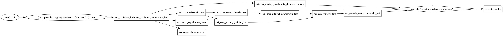

<!-- BEGIN_TF_DOCS -->

# Requirements

| Name | Version |
| ---- | ------- |
| oci  | 7.21.0  |

# Providers

| Name | Version | Alias |
| ---- | ------- | ----- |
| oci  | 7.21.0  | n/a   |

# Inputs

| Name                      | description                                    | Type                                                                                 | Required | Default | File                |
| ------------------------- | ---------------------------------------------- | ------------------------------------------------------------------------------------ | -------- | ------- | ------------------- |
| auth_config               | Terraform実行時のOCI認証情報                   | `object({ user = string, fingerprint = string, tenancy = string, region = string })` | yes      | n/a     | [main.tf](/main.tf) |
| trocco_registration_token | TROCCO Self-Hosted-RunnerのRegistration Token  | `string`                                                                             | yes      | n/a     | [main.tf](/main.tf) |
| trocco_shr_image_url      | TROCCO Self-Hosted-RunnerのコンテナイメージURL | `string`                                                                             | yes      | n/a     | [main.tf](/main.tf) |

# Resources

| Type        | Name                                                                                                                                                                   | File                | Comment                                                                                                                                                                                                                                                             |
| ----------- | ---------------------------------------------------------------------------------------------------------------------------------------------------------------------- | ------------------- | ------------------------------------------------------------------------------------------------------------------------------------------------------------------------------------------------------------------------------------------------------------------- |
| resource    | [oci_container_instances_container_instance.shr_test](https://registry.terraform.io/providers/oracle/oci/7.21.0/docs/resources/container_instances_container_instance) | [main.tf](/main.tf) | Container Instances サービスログでの連携対象に入っていない; ref: https://docs.oracle.com/en-us/iaas/Content/Logging/Reference/service_log_reference.htm コンテナを操作するAPIはある; ref: https://docs.oracle.com/en-us/iaas/api/#/en/container-instances/20210415/ |
| resource    | [oci_core_internet_gateway.shr_test](https://registry.terraform.io/providers/oracle/oci/7.21.0/docs/resources/core_internet_gateway)                                   | [main.tf](/main.tf) | インターネットゲートウェイ                                                                                                                                                                                                                                          |
| resource    | [oci_core_route_table.shr_test](https://registry.terraform.io/providers/oracle/oci/7.21.0/docs/resources/core_route_table)                                             | [main.tf](/main.tf) | インターネットゲートウェイへのルート                                                                                                                                                                                                                                |
| resource    | [oci_core_security_list.shr_test](https://registry.terraform.io/providers/oracle/oci/7.21.0/docs/resources/core_security_list)                                         | [main.tf](/main.tf) | セキュリティリスト                                                                                                                                                                                                                                                  |
| resource    | [oci_core_subnet.shr_test](https://registry.terraform.io/providers/oracle/oci/7.21.0/docs/resources/core_subnet)                                                       | [main.tf](/main.tf) | サブネット                                                                                                                                                                                                                                                          |
| resource    | [oci_core_vcn.shr_test](https://registry.terraform.io/providers/oracle/oci/7.21.0/docs/resources/core_vcn)                                                             | [main.tf](/main.tf) | VCN                                                                                                                                                                                                                                                                 |
| resource    | [oci_identity_compartment.shr_test](https://registry.terraform.io/providers/oracle/oci/7.21.0/docs/resources/identity_compartment)                                     | [main.tf](/main.tf) | コンパートメント                                                                                                                                                                                                                                                    |
| data source | [oci_identity_availability_domains.domains](https://registry.terraform.io/providers/oracle/oci/7.21.0/docs/data-sources/identity_availability_domains)                 | [main.tf](/main.tf) | 可用性ドメインの参照                                                                                                                                                                                                                                                |

# Dependency Graph

## Overview

## Detail

<!-- END_TF_DOCS -->

# Setup

- Generate API Key; ref: https://docs.oracle.com/ja-jp/iaas/Content/dev/terraform/configuring.htm
